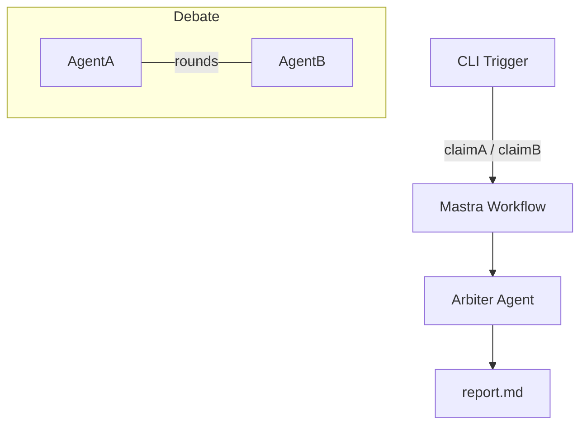

# AI‑to‑AI Debate Platform – PRD (Hackathon v0.1)

> **Time‑box**: 2 hours total.  
> **Goal**: deliver a runnable Mastra workflow that lets two agents debate, an arbiter summarise, and outputs `report.md`.

---

## 1 · Vision
Give users a **one‑click way to resolve disagreements** by delegating the argument to their personal AI agents. The system produces a clear, unbiased Markdown report showing agreements, disagreements, compromise, and a confidence score.

## 2 · Target Users & Jobs‑to‑Be‑Done
| Persona | JTBD | Pain Today |
|---------|------|-----------|
| Friends / Couples | "Settle an argument without hard feelings." | Emotional friction, bias |
| Co‑founders | "Decide roadmap priorities quickly." | Endless meetings |
| VCs / PE analysts | "Validate conflicting claims during DD." | Manual expert calls |
| DAO members | "Find consensus on proposals." | Forum noise, voter apathy |

## 3 · Value Proposition
- **Speed** – <60 s automated debate.
- **Impartiality** – arbiter model applies rules & citations.
- **Transparency** – full debate log + confidence metric.

## 4 · Functional Requirements (MVP)
1. **Input Phase**  
   `claimA` & `claimB` (string) via CLI trigger.  
   Optional: `constraints` object (ignored for hackathon).
2. **Agent Briefing**  
   `AgentA` & `AgentB` instantiated with user claims.
3. **Debate Engine**  
   Two turn‑based rounds (A→B→A→B). Each turn must:  
   – reference opponent’s last message  
   – cite at least one fact (simple "[citation needed]" placeholder is OK).
4. **Arbiter Phase**  
   Generates Markdown summary containing:  
   *Areas of Agreement* / *Disagreement* / *Suggested Compromise* / *Confidence 0‑100*.
5. **Output Phase**  
   Save to `report.md`; print path to console.

## 5 · Non‑Functional Requirements
- **Local first** – no extra cloud infra; run with `ts-node`.
- **Cheap** – ≤ 3 OpenAI calls (gpt‑4o‑mini) per run.
- **Deterministic** – set `temperature 0.3`.
- **Readable** – Markdown report uses headings & bold for sections.

## 6 · Technical Design
**Stack**: Mastra (Core v0.13), TypeScript 5, OpenAI SDK, dotenv.



### Components
| File | Purpose |
|------|---------|
| `src/agents/debaters.ts` | Factory `makeDebater()` + singleton `arbiter` |
| `src/workflows/debate.workflow.ts` | Step graph: init → A1 → B1 → judge |
| `src/run.ts` | CLI runner / dev entry |
| `report.md` | Generated output |

## 7 · Data Schemas
```ts
// Trigger
{
  claimA: string,
  claimB: string
}

// judge output
interface Summary {
  agreement: string;
  disagreement: string;
  compromise: string;
  confidence: number; // 0‑100
}
```

## 8 · Acceptance Criteria
- [ ] Running `npm start -- "Cats are better" "Dogs are better"` creates `report.md`.
- [ ] Report includes *all four* required sections.
- [ ] Mastra trace shows 4 steps and completes <90 s.

## 9 · Development Plan (120 min)
| Min | Task |
|-----|------|
| 0‑10 | Repo init, install deps, set `.env` |
| 10‑25 | Write agents file |
| 25‑55 | Build workflow + run test |
| 55‑70 | Polish prompts, add timestamp header |
| 70‑80 | README with run instructions & screenshot note |
| 80‑100 | Record 90‑sec Loom demo |
| 100‑115 | Fill hackathon form |
| 115‑120 | Buffer / coffee |

## 10 · Future Extensions (Post‑hackathon)
- Retrieval‑augmented fact checks (Wikipedia RAG).
- Web UI wizard (Next.js + shadcn/ui).
- Multi‑party (>2) debates with ranking.
- Stripe‐metered API.
- Evaluation harness (GPT‑Judge) for quality scoring.

## 11 · Skeleton Code Snippet
```ts
// src/run.ts
import { runWorkflow } from "@mastra/core";
import { debateWorkflow } from "./workflows/debate.workflow";

runWorkflow(debateWorkflow, {
  triggerData: {
    claimA: process.argv[2] ?? "Cats rule.",
    claimB: process.argv[3] ?? "Dogs drool."
  }
}).then(({ results }) => {
  const md = "# ResolveAI Demo\n\n" + results.judge.report;
  require("fs").writeFileSync("report.md", md);
  console.log("✅  report.md saved");
});
```

---
**Ready to vibe‑code in Cursor 🎧** – drop this `AI-Debate-PRD.md` in your repo, open it side‑by‑side, and ask Cursor to generate each file stub. Good hacking! 🚀
